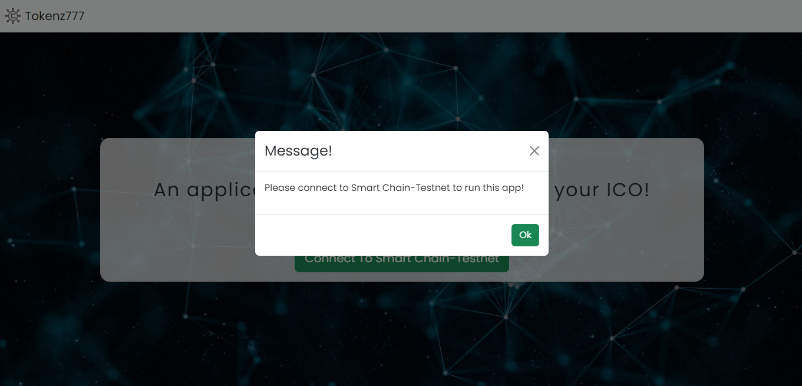
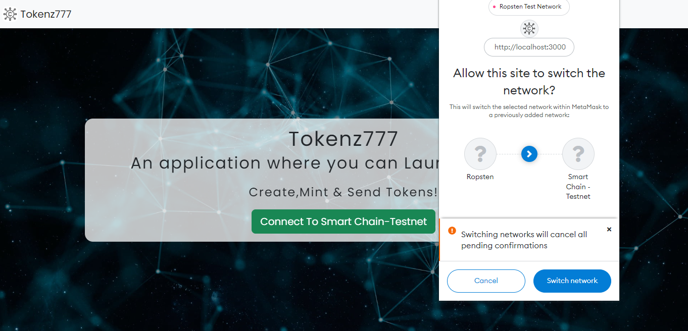
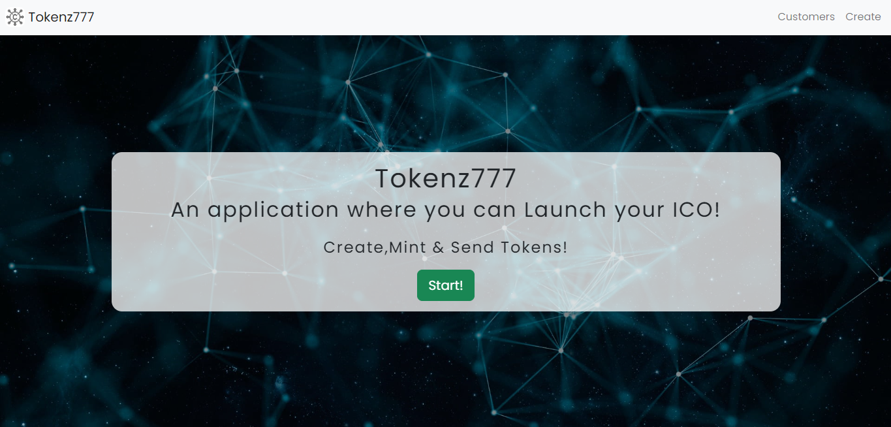
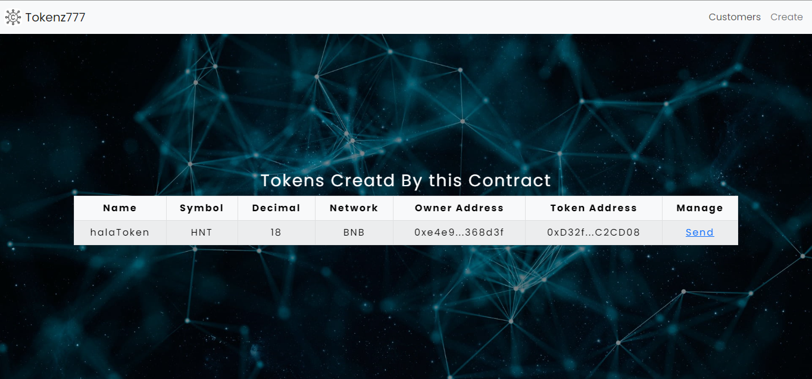
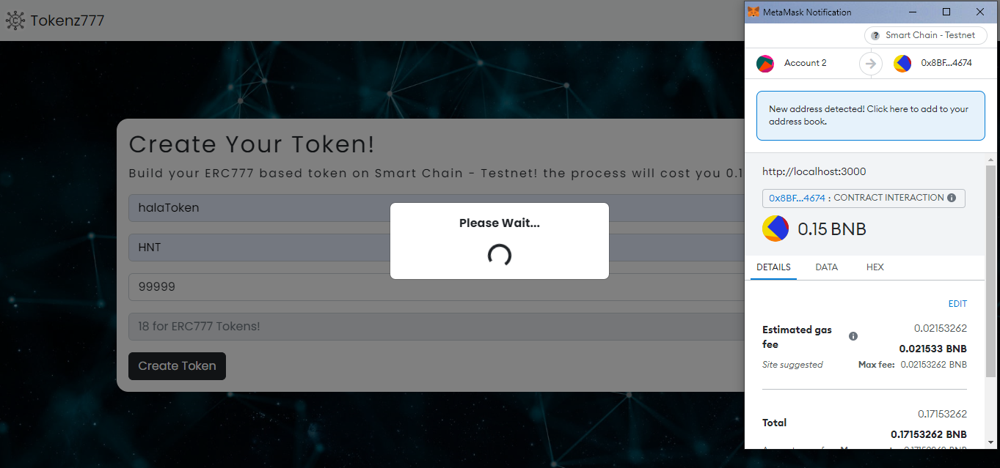
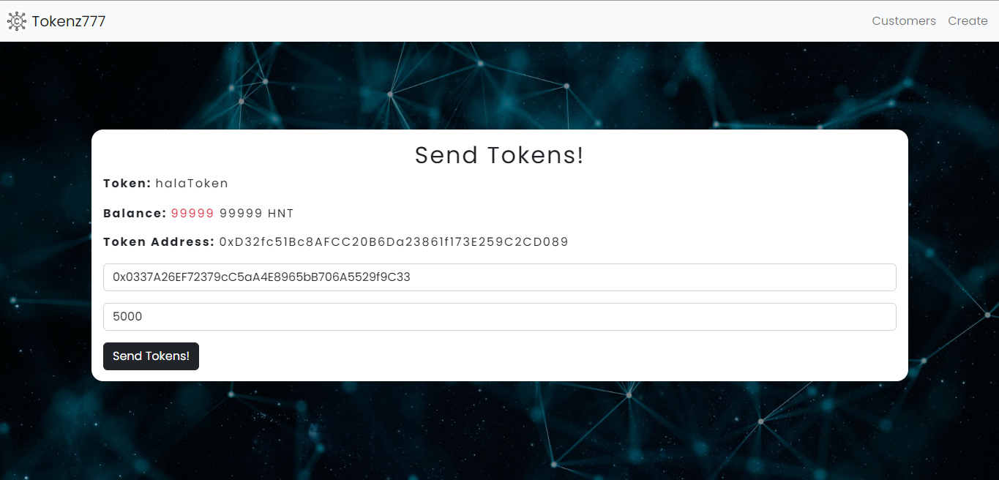
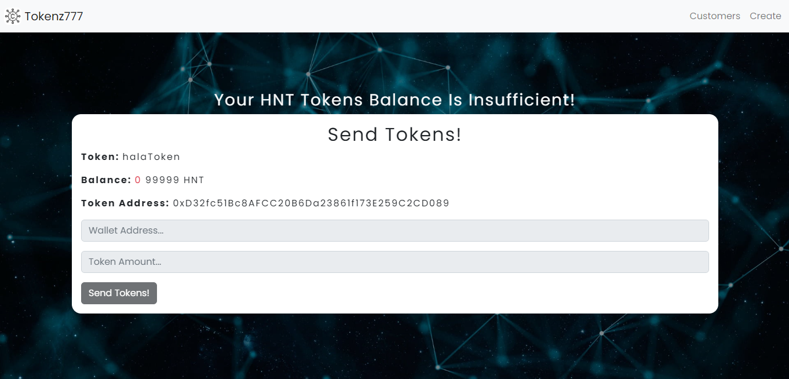

<div  align="center" style ="width=200px ;height=200px  ">
</a>
</div >

<h3 align="center">Tokenz777</h3>

---

<p align="center"> An application where you can launch your ICO!
    <br> 
</p>

## Table of Contents

- [About](#about)
- [Getting Started](#getting_started)
- [Usage](#usage)
- [Built Using](#built_using)
- [Link](#link)

## About <a name = "about"></a>

- Tokenz777 is a decentralized web application built on Smart Chain-Testnet.
- This is V01 of Tokenz777 modified to test [tokenzsdk-v0](https://www.npmjs.com/package/tokenzsdk-v0) package.

<b>Features:</b>

<li>The user can create tokens based on ERC777 template.</li>
<li>The user can send tokens to others.</li>
<li>The user must be connected to Smart Chain-Testnet to be able to access the content of the application.</li>

## Getting Started <a name = "getting_started"></a>

These instructions will get you a copy of the project up and running on your local machine for development and testing purposes.

### Prerequisites

you need to have the following installed in your machine:

- [VS Code](https://code.visualstudio.com/)
- [Git Bash](https://git-scm.com/downloads)
- [Node JS](https://nodejs.org/en/download/)

### Installing

A step by step series of examples that tell you how to get a development env running.

1. Clone the repo to your local machine git bash.

```sh
git clone https://github.com/HalaNHasan/Tokenz777--V01--.git
```

2. Install the needed packages inside the frontend folder

```sh
npm i
```

3.Run application using git bash inside frontend folder.

```sh
npm run start
```

## Usage <a name="usage"></a>

1. Welcome Page

- The user must have metamask installed & must be connected to the Smart Chain-Testnet to access the content of the application.
  </a>
  </a>
  </a>

1. Main Page

- All tokens created by the contract are going to be rendered in the main page.
- For tokens created by the user: send option will be shown for the current user.
  </a>

2. Create Tokens

- The user can create tokens by using "Create" feature.
- Token name,symbol & total supply are required to create a new ERC777 token.
- This operation will cost the user 0.15BNB + gas fees of the process.
  </a>

3. Send Tokens

- The user can send tokens if he has at least 1 unit of this token in his balance.
- Once send link is clicked;the user will be redirected to the send page.
- In the send page;token name,user balance of this token & token address will be shown.
- This operation is free;only gas fees of the process will be paid.
  </a>
  </a>

## Built Using <a name = "built_using"></a>

- [React JS](https://https://reactjs.org/)

## Link <a name = "link"></a>

- [Tokenz777-V01](http://HalaNHasan.github.io/Tokenz777--V01--)
